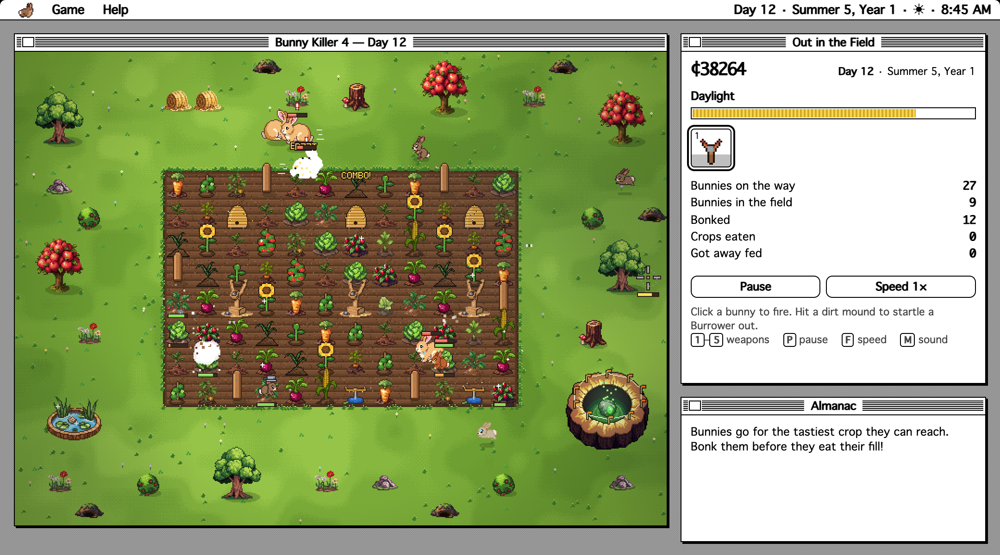
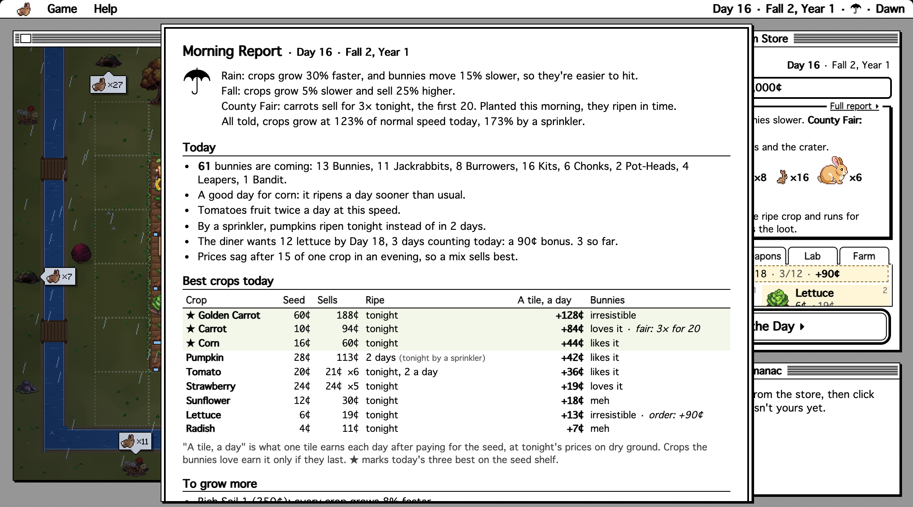
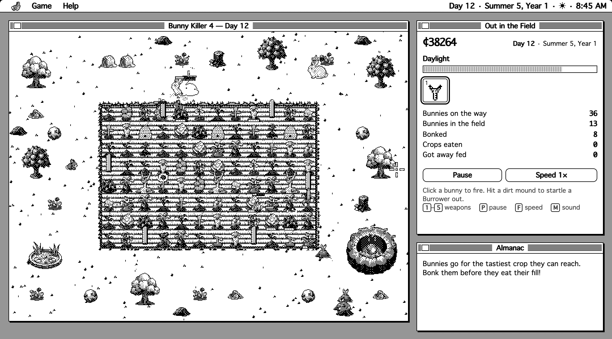
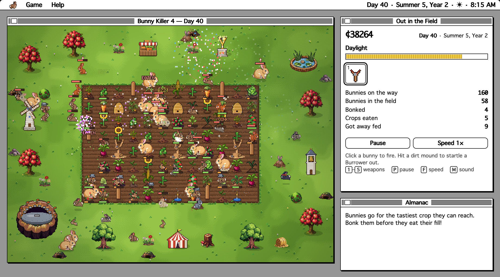

# Bunny Killer 4



**A farm sim and tower defense game that plays in your browser, and the long-awaited follow-up to
_Bunny Killer II_ (1993) and _Bunny Killer 3_ (1994) for the Macintosh.**

> *It's been years since the asteroid. The bunnies never left… and some of them glow.*

Plant crops in the morning. Build defenses around them, then spend the day bonking bunnies with your sling
from the porch, and sell whatever's left at sundown. Every bunny that gets home fed brings a friend tomorrow.
Save up to seal the crater the bunnies keep coming out of, and survive the Last Night.

It looks and sounds like 1993: a System 7 desktop with a menubar, Balloon Help, and a chiptune score, and a
**1993 Mode** that shows the whole farm in black and white, the way a Mac Plus would have.

## Play

Build the one-file version and double-click it:

```sh
npm install
npm run build:single      # writes dist/bunny-killer-4.html
open dist/bunny-killer-4.html
```

That file is the whole game, about half a megabyte with the art, sound, and code inside. It needs no server
and nothing online, and your farm saves in the browser. It plays with a mouse or on a touch screen (an iPad,
or a phone held sideways).

To work on it, run the dev server: `npm run dev`, then open http://localhost:5190. (The npm scripts set
environment variables the Unix way; on Windows, run them from WSL or Git Bash.)

## What's in it

- **A farm to run.** Ten crops, from radishes to watermelons and golden carrots. Some ripen in a day, some take
  three, and strawberries and tomatoes keep fruiting. Four seasons change how fast things grow and what they sell
  for, and the weather changes both. Prices move with the market: flood it with carrots and they sell cheap;
  let them rest and town pays more. Buy land a lot at a time, till it, and lay the farm out your way.
- **Bunnies to stop.** Thirteen kinds: jackrabbits, Burrowers that tunnel under your fences, Chonks, litters
  of kits, Pot-Heads whose helmets stop pebbles, Leapers, Bandits that run off with whole crops, Ninjas that
  sidestep, a Bunny Queen, the glowing Asteroid Bucks, and a golden bunny worth catching.
- **Defenses and weapons.** Fences, snap traps, scarecrows, sprinklers, sling turrets, a dog, thumpers,
  decoys, and beehives, each upgradable to five stars, with combos when they work together. From the porch:
  the sling, a pellet gun, a spud gun, a garden hose, and a firework launcher.
- **A goal.** Fund the three stages of the Crater Project, beat the Bucks that guard it, and survive the Last
  Night. Win and Hard Mode opens, and your farm can go on to build the **Farm Legacy**: five landmarks, from a
  roadside stand to a golden slingshot, each with a perk.
- **Something new most days.** Orders from town, a County Fair, hail, droughts, a travelling merchant's cart,
  and a store that opens up as you go. The **Morning Report** explains the weather, ranks the crops by what a
  tile earns today, and says what would help.
- **More ways to play.** Three farms to choose from, a **Daily Farm** that's the same ten days for everyone,
  26 achievements and a Bunny Guide, and **Classic Mode**, the original shooting gallery.

<table>
  <tr>
    <td></td>
    <td></td>
  </tr>
  <tr>
    <td align="center"><sub>The Morning Report</sub></td>
    <td align="center"><sub>1993 Mode</sub></td>
  </tr>
  <tr>
    <td colspan="2"></td>
  </tr>
  <tr>
    <td colspan="2" align="center"><sub>After the win: the Farm Legacy on Old Orchard, and a lot of bunnies</sub></td>
  </tr>
</table>

## How to play

Each day has three parts:

1. **Morning: plan.** Buy seeds and click your tilled soil to plant them. Put defenses anywhere on your land.
   Check the Scouting Report (click it for the full Morning Report) and the burrows around the field: each
   one's tag says how many bunnies will come out of it.
2. **Day: defend.** Crops grow while bunnies go for the tastiest one they can reach. Click a bunny to fire.
   Once they're all dealt with, **All clear!** lets you skip to sundown.
3. **Evening: harvest.** Ripe crops sell at tonight's prices. Unripe ones stay in the ground for tomorrow.

The first game has a tutorial, and Help › How to Play covers the rest. The full design, with every number,
is in [DESIGN.md](DESIGN.md).

| | |
|---|---|
| Click / drag on your land | place the selected seed or defense (crops, fences and the hoe paint along a drag) |
| `H` / `L` | the hoe (till grass so crops can grow) / buy land (click a lot for sale, or drag across several) |
| `B` | a smoke bomb: click the crater and an Asteroid Buck comes out today (after your first Buck) |
| Right-click | dig up a crop or sell a defense (full refund for anything bought today) |
| `1`–`9`, `0` | seeds, in store order (planning) |
| `1`–`5`, mouse wheel | switch weapons (during the day) |
| `Q W E R T Y`, `A S D` | defenses: fence, snap trap, scarecrow, sprinkler, sling turret, dog, thumper, decoy, beehive |
| `X` / `U` / `Esc` | dig-up/sell tool / upgrade tool / put the tool down |
| `Space` | start the day (planning), pause (during the day) |
| `Enter` / `Esc` | when the **All clear!** box is up: skip to sundown / keep watching |
| Click a bunny | fire (hold for the pellet gun and hose); click a dirt mound to startle a Burrower out |
| `F` / `M` / `N` | day speed 1×/2×/4× / sound / music |
| Touch | tap where you'd click; drag to paint a row. A tap near a bunny counts as a hit on it. |

The Game menu also has **Sound…** (volume sliders), **Always Skip When All Clear**, **Daily Farm…**, and
**1993 Mode**; the Help menu has the **Bunny Guide…**, **Achievements…**, and **Replay the Intro**.

## Where it comes from

_Bunny Killer II_ (1993) and _Bunny Killer 3_ (1994) were Macintosh games by Jonathan Sweet (Modified
Environments): bunnies, a farm, and a sling. Bunny Killer 4 picks up years after an asteroid came down on the
farm, adds the farming and the tower defense, and keeps the original shooting gallery as Classic Mode.

## Development

```sh
npm install
npm run dev                                   # the game, at http://localhost:5190, with debug hooks
npm test                                      # headless rules tests: pathfinding, the economy, unlocks, the Crater
                                              # Project, the market, orders, events, combos, golden bunnies, farms, the
                                              # Daily Farm, the Farm Legacy, the Morning Report, achievements, saves
npm run typecheck
npm run build                                 # a static site in dist/, for any web server
npm run build:single                          # plus dist/bunny-killer-4.html, the one-file version
```

Run things through `npm run …`: the scripts set `NODE_ENV` themselves, and the dev-only debug hooks need it.
There's no server side. The game is plain HTML, JavaScript and inlined pixel art, and saves live in the
browser's localStorage. Browsers won't run `dist/index.html` straight from disk (they block its script over
`file://`), which is what the one-file build is for.

- Balance numbers (crops, defenses, upgrades, bunnies, seasons, weather, prices) are all in `src/config.ts`.
- `http://localhost:5190/sprites.html` shows every sprite blown up, for art work.
- In dev builds, `window.bk4` exposes `game`, `ui`, `hooks`, `renderer`, and `step(seconds)` for poking at the
  game from the console.

**Balance.** Test bots play whole campaigns at three skill levels:

```sh
BALANCE=1 SEED=7 npm test -- tests/balance.test.ts          # 70-day campaigns, day by day (SEED, DAYS=n, HARD=1)
BALANCE=1 SEED=7 REPS=6 npm test -- tests/balance.test.ts   # six seeded replays per skill, one summary line each
```

Judge a change over several seeds (99, 7, 3) with `REPS=6`, not one run. When a bot busts or wins oddly, check
its own habits in `tests/helpers.ts` before retuning the game. To try a Hard Mode tweak without editing
config, set `HARD_WAVES`, `HARD_HP`, `HARD_BOSSHP`, or `HARD_ANGER`.

**Screenshots.** The scripts in `scripts/` drive the game in headless Chrome (through `playwright-core`,
pointed at the Mac's Chrome app; change `executablePath` for yours) and write screenshots to `shots/`. Run
them from the repo root while the dev server is up.

- `scripts/tour.mjs`: the main screens, at Retina scale
- `scripts/readme-shots.mjs`: the pictures in this README, in `docs/screenshots/`
- `scripts/sidebar-fit.mjs`: at five common window sizes, checks that the store fits and that no Almanac entry
  is cut off
- `scripts/progress.mjs`: unlocks, the Crater Project, the Last Night, and the Year 2 bunnies
- `scripts/arsenal.mjs`: the store tabs, weapons in action, and the new bunnies
- `scripts/modes.mjs`: the All clear! box, Repair All, and Hard Mode
- `scripts/smoke.mjs`: the smoke bomb, the smoke, and the Buck it brings out
- `scripts/growth.mjs`: the ripening tags on the seed shelf and the growth Almanac
- `scripts/farms.mjs`: the farm picker, River Bend, and Old Orchard
- `scripts/golden.mjs`, `events.mjs`, `combos.mjs`: golden bunnies, the day's events, and combos
- `scripts/victory.mjs`: the cap coming down, the fireworks, and Keep Farming
- `scripts/legacy.mjs`: the Farm Legacy: landmarks going up, the finale, the noon bell, all three farms
- `scripts/report.mjs`: the Scouting Report, its hover, the Morning Report, and the day's best seeds
- `scripts/daily.mjs`, `trophies.mjs`: the Daily Farm and its results, achievements, and the Bunny Guide
- `scripts/touch.mjs`: a morning and a day played with taps, on an iPad and on a phone held sideways
- `scripts/retro.mjs`: 1993 Mode, and how long its black-and-white pass takes
- also `art.mjs`, `art2.mjs`, `shot.mjs`, `playtest.mjs`, `fx.mjs`, `seasons.mjs`, `classic.mjs`, and `burrows.mjs`

**Art.** The sprites were generated on sprite-ai.art from one shared style (`sprite-style.md`), then cleaned up
by `scripts/process-sprites.py`. The raw generations live in `assets/sprites/`, the rejected takes in
`assets/rejects/`. Traps, sprinklers, fences, the landmarks, and the icons are drawn in code.

```sh
node scripts/gen-sprites.mjs --dry-run      # what would be generated from assets/sprites/manifest.json
node scripts/gen-sprites.mjs --only NAME    # generate one (needs SPRITE_AI_KEY; skips anything already on disk)
python3 scripts/process-sprites.py          # raw assets/sprites/ -> game-ready src/art/sprites/
```

Don't set `reference_asset_id` when generating: on sprite-ai.art it copies the reference image's content, not
just its style.

**Layout.**

```
src/
  config.ts        every tunable number
  game.ts          rules and state machine (no DOM, so it runs in tests)
  sim/bunnies.ts   bunny AI: seek, eat, chew, spooked, flee
  sim/defenses.ts  traps, scarecrows, sprinklers, turrets, dogs, pebbles
  path.ts          grid Dijkstra
  world.ts         the three farms' layouts, the grid of lots, scenery, burrows, the Daily Farm's pick
  achievements.ts  the achievements and what earns them
  advice.ts        the Morning Report's advice: the weather in plain words, crops ranked by return, tips, upgrades
  classic.ts       Classic Mode rules (the shooting gallery)
  render/          sprite loading, the renderer (ground, lighting, weather), particles, pixel font,
                   icons and landmarks drawn in code, and mono.ts (1993 Mode's black and white)
  art/sprites/     processed sprites (generated by scripts/process-sprites.py)
  ui/ui.ts         System 7 chrome: menubar, Farm Store, Almanac, dialogs
  ui/balloons.ts   Balloon Help and the first-game tutorial
  audio.ts         synthesized sound effects (WebAudio, no files)
  music.ts         the chiptune sequencer and its four songs
  save.ts          localStorage: the autosave, settings, high scores, the Daily Farm, achievements, the Bunny Guide
```
